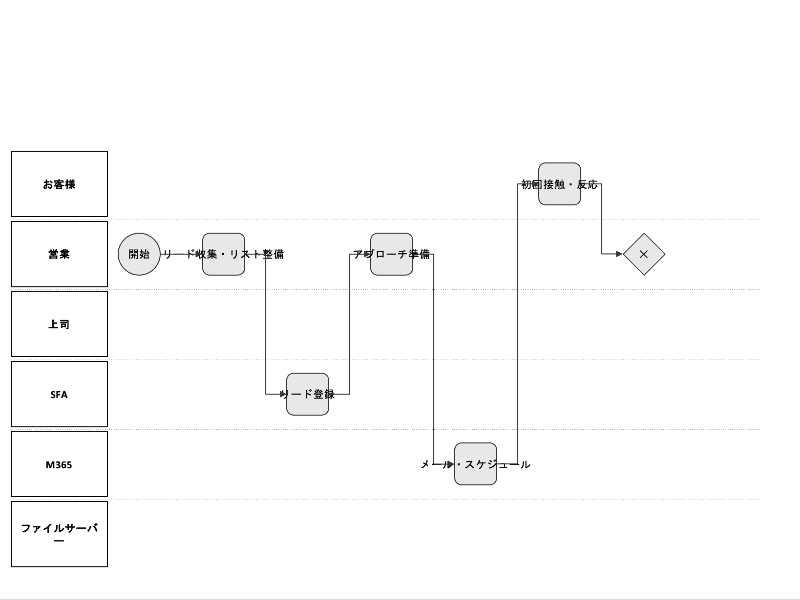

# process-to-pptx

業務プロセス図を **YAML** または **mxGraph XML** から編集可能な PowerPoint（PPTX）に変換する CLI ツール。XML は .drawio 形式にも変換できる。

## 機能概要

| 入力 | 出力 | 用途 |
|------|------|------|
| YAML（業務プロセス定義） | PPTX | スイムレーン・タスク・分岐・接続を 1 枚スライドに描画（**推奨**） |
| mxGraph XML | .drawio | draw.io で開ける形式に変換 |
| mxGraph XML / .drawio | PPTX | 既存の図を PPTX スライドに変換 |
| mxGraph XML | .drawio + PPTX | 一括パイプライン（中間 .drawio は任意で保存） |

## 要件

- **Python 3.10+**
- [uv](https://docs.astral.sh/uv/)（推奨。`pip install` でも可）

## セットアップ

```bash
uv sync
```

## 使い方

### YAML から PPTX（推奨）

業務プロセスを YAML で定義し、そのまま PPTX に変換する。

```bash
uv run process-to-pptx from-yaml input/process.yaml -o output/process.pptx
```

- **YAML スキーマ**: [docs/yaml-schema.md](docs/yaml-schema.md) を参照。
- **ノード種別**: `start`（開始）・`task`（タスク）・`gateway`（分岐）・`end`（終了）・`artifact`（成果物）・`service`（システム接続）。
- **接続**: `next` でフロー、`request_to` / `response_from` で人⇔サービスの点線。分岐の矢印ラベル（Yes/No 等）やループ（開始ノードへ戻る）にも対応。

### XML を .drawio に変換

```bash
uv run process-to-pptx to-drawio input.xml -o diagram.drawio
# 標準入力から
cat input.xml | uv run process-to-pptx to-drawio - -o diagram.drawio
```

### .drawio / XML から PPTX を生成

```bash
uv run process-to-pptx to-pptx diagram.drawio -o slides.pptx
```

### 一連フロー（XML → .drawio → PPTX）

```bash
uv run process-to-pptx pipeline input.xml -o output.pptx
# 中間 .drawio も保存する場合
uv run process-to-pptx pipeline input.xml -o output.pptx --drawio diagram.drawio
```

## Docker

Docker のみで変換する場合: **input/** に YAML を置き、`docker compose run convert` で **output/** に PPTX が出力される。

```bash
docker compose build
docker compose run convert
```

- **入力**: `input/` 内の `.yaml` / `.yml` をすべて変換対象とする。
- **出力**: 各ファイルごとに `output/<ファイル名のstem>.pptx` が生成される。
- ボリューム: `./input` → `/input`、`./output` → `/output`（`docker-compose.yml` 参照）。

## 出力の確認

- **図形数**: `from-yaml`・`to-pptx`・`pipeline` 実行時、標準エラーに `Shapes: N` が表示される。図形が 0 の場合は `Warning: no shapes were added to the slide. Check input.` が出る。
- **孤立ノード**: `from-yaml` で、入出辺のないフローノードがあると警告する。
- **プレビュー**: 生成した PPTX は PowerPoint / Keynote / LibreOffice Impress などで開いて配置・テキストを確認する。

### サンプル出力

YAML から生成した PPTX のスライド例（銀行営業プロセス）:




## 入力形式

### YAML（業務プロセス図）

- スキーマ: [docs/yaml-schema.md](docs/yaml-schema.md)
- **actors**: スイムレーン名のリスト（左から右の順）。
- **nodes**: 各ノードに `id`・`type`・`actor`・`label`・`next` を指定。分岐は `gateway_type`、矢印ラベルは `next` のオブジェクト形式、システム接続は `request_to` / `response_from` で記述。

### mxGraph XML

- **mxGraphModel** に準拠した XML を想定。
- `<mxGraphModel>...</mxGraphModel>` 全体、または `<root>` 内の mxCell 断片を入力可能。
- 1 ページ・基本的な図形（四角、楕円など）とテキストを優先して PPTX に反映する。

## プロジェクト構成

```
process_to_pptx/
  cli.py        # サブコマンド: from-yaml, to-drawio, to-pptx, pipeline
  yaml_loader.py # YAML 読み込み・レイアウト計算（スイムレーン・列配置）
  yaml2pptx.py   # YAML → PPTX 描画（図形・コネクタ・矢印）
  xml2drawio.py  # mxGraph XML → .drawio 文字列
  xml2pptx.py    # mxGraph XML → PPTX
docs/
  yaml-schema.md # YAML スキーマ説明
  examples/      # サンプル YAML
input/           # 変換元 YAML 置き場（Docker では /input にマウント）
output/          # 変換後 PPTX 置き場（Docker では /output にマウント）
scripts/
  docker-entrypoint.sh # Docker 起動時: input 内全 YAML → output に PPTX
tests/           # pytest（test_yaml_loader, test_yaml2pptx, test_xml2*, test_cli）
```

## 開発

```bash
uv sync --all-extras   # dev 依存も入れる
uv run pytest          # テスト
uv run ruff check .    # リント
```

## ライセンス・依存関係

- **python-pptx** (≥0.6.21), **PyYAML** (≥6.0) を使用。
- 詳細は [pyproject.toml](pyproject.toml) を参照。
